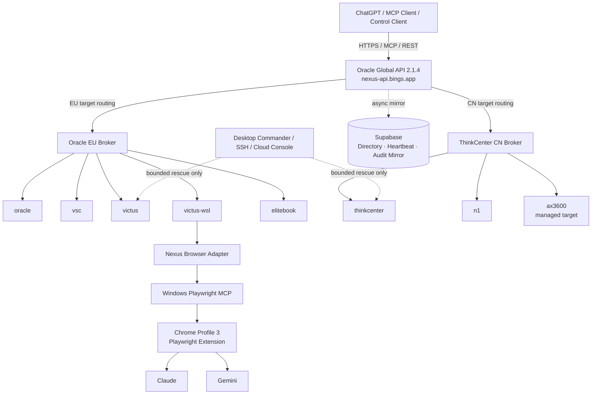

# 🌐 Nexus: Distributed Multi-Node Control Plane

[](LICENSE)
[](https://www.python.org/downloads/)
[](https://modelcontextprotocol.io/)
[](docs/FINAL_ACCEPTANCE_REPORT.md)

**Nexus** 是面向个人异构基础设施的跨端分布式智能控制平面。它让 ChatGPT、MCP 客户端和受控自动化程序，以明确目标、区域就近、幂等执行和真实回执的方式，统一控制 Linux、Windows、WSL、HPC 与 OpenWrt 节点。

当前生产基线为 **Nexus v2.5-regional**。统一入口是 `https://nexus-api.bings.app`，Global API 位于 Oracle，EU 与 CN 各自拥有区域 Broker。Supabase 只保留设备目录、心跳、审计和异步镜像职责，不再承担正常任务热队列。

---

## 核心原则

- **直接目标调度**：Agent 在线时，命令必须直接下发到用户指定的 `target_device`。
- **目标不可变**：Broker 故障转移只能改变传输路径，不能把任务改派到另一台设备。
- **真实回执**：只有获得 `completed`、正确 `exit_code` 和可验证输出后才报告成功。
- **幂等执行**：每个任务包含 UUID、idempotency key、lease、attempt，并由本地 execution ledger 防止重复执行。
- **救援有界**：SSH、Victus WSL、Desktop Commander 和云控制台只在目标 Agent 失效时使用，并明确标注为救援路径。
- **凭据不外泄**：Token、密码、Cookie、私钥和浏览器会话数据不进入聊天、日志、Git 或 transcript。
- **设备身份签名**：Agent 鉴权升级为每设备 Nexus 专用 Ed25519 keypair；Global API 保存公钥和批准状态，Broker 验签，不再让 Agent 保存 API token。

---

## 最新生产架构



### 关键数据流

```text
ChatGPT / MCP Client
        │
        ▼
https://nexus-api.bings.app
Oracle Global API 2.1.4
        │
        ├────────────── EU target ──────────────► Oracle EU Broker
        │                                          ├─ oracle
        │                                          ├─ vsc
        │                                          ├─ victus
        │                                          ├─ victus-wsl
        │                                          └─ elitebook
        │
        └────────────── CN target ──────────────► ThinkCenter CN Broker
                                                   ├─ thinkcenter
                                                   ├─ n1
                                                   └─ ax3600 (managed target)

Browser advisor path:
ChatGPT → Nexus → victus-wsl → Windows Playwright MCP
        → Chrome Profile 3 Extension → Claude / Gemini
```

---

## 区域与节点职责

| 规范 ID | 平台 | 区域 | 角色 |
|---|---|---|---|
| `oracle` | Ubuntu Linux | EU | Global API、EU Broker、外部探针与全球跳板 |
| `vsc` | RHEL / HPC | EU | KU Leuven 计算节点，长任务通过 Slurm |
| `victus` | Windows 11 | EU | 主力工作站与 Windows 原生任务 |
| `victus-wsl` | WSL2 | EU | 浏览器顾问主节点与 Linux 执行环境 |
| `elitebook` | Windows / Linux | EU | 移动工作节点 |
| `thinkcenter` | Ubuntu Linux | CN | 家庭生产中枢与 CN Broker |
| `n1` | iStoreOS / OpenWrt | CN | 网络救援、路由和家庭 LAN 管理 |
| `ax3600` | Managed target | CN | 被管理网络设备，不伪装为 Agent |

别名只用于 Agent 匹配，不得在设备目录中创建重复设备记录。

---

## Browser Advisor

Nexus 可以复用用户常用 Chrome Profile 中已经存在的 Claude 与 Gemini 登录会话，不复制 Cookie、不导出密码，也不调用隐藏 Provider API。

正式链路：

```text
Nexus job
→ victus-wsl Nexus Agent
→ browser-bridge/nexus_browser_adapter.py
→ Windows Playwright MCP
→ Chrome Profile 3 Playwright Extension
→ Claude / Gemini visible web UI
```

Browser Adapter 提供：

- Claude / Gemini Provider 专用页面完成检测；
- JSON 结构化回执；
- append-only JSONL 与 Markdown transcript；
- prompt / response SHA-256；
- idempotency ledger；
- 硬超时和明确失败类型；
- 不绕过 CAPTCHA、Cloudflare 真人验证或 MFA。

完整双轮交叉评审证据位于 `docs/evidence/acceptance/nexus-final-review/`。

---

## 任务生命周期与 API

```text
pending → claimed → running → completed / failed / timeout / cancelled
```

普通控制只使用 Global API 或等价 MCP 工具：

| 操作 | HTTP 接口 | 说明 |
|---|---|---|
| 健康检查 | `GET /health` | Global API 版本、位置与 Broker 映射 |
| 设备列表 | `GET /api/devices` | 规范设备、心跳年龄和在线状态 |
| 单目标执行 | `POST /api/execute` | 明确指定 `device`、命令、等待和超时 |
| 批量执行 | `POST /api/execute-batch` | 每个目标创建独立 job |
| 查询任务 | `GET /api/jobs/{job_id}` | 获取长任务最终状态和真实输出 |

等价 MCP 工具通常包括：

- `list_devices()`
- `get_status(device_id)`
- `execute_command(device, command, wait_seconds, timeout_ms)`
- `get_job(job_id)`

普通用户和普通 Agent 不应直接操作 Broker 的 `/submit`、`/claim` 和 `/complete`。

---

## 一键部署

### Linux / macOS / 云服务器 / OpenWrt

```bash
curl -fsSL https://nexus-api.bings.app/install.sh | bash
```

显式指定规范设备 ID：

```bash
curl -fsSL https://nexus-api.bings.app/install.sh | bash -s -- victus-wsl
```

### Windows

```powershell
irm https://nexus-api.bings.app/install.ps1 | iex
```

生产节点必须使用单实例锁和平台监督器：Linux 使用 systemd，Windows 使用计划任务，OpenWrt 使用 procd，VSC 使用 watchdog 与共享目录锁。

---

## 安全与恢复边界

- 不显示或提交 API Token、Cloudflare Token、密码、私钥、Cookie 或完整凭据文件。
- Windows 使用 PowerShell；Linux 使用非交互 Bash；OpenWrt 使用 POSIX ash；VSC 长任务使用 Slurm。
- API 等待超时不等于任务失败，应继续按原 job ID 查询，不生成语义重复的新任务。
- Agent 失效时，恢复顺序是：本机监督器 → Broker 健康 → Tailscale/隧道 → 标明的救援通道。
- 整机重启、WAN、VLAN、PPPoE、防火墙、数据删除等高风险操作需要明确确认、备份与回滚路径。

---

## 验收与发布状态

软件与服务级结项已经通过：

- Global API `2.1.4`；
- Victus Windows Agent 连续 10/10 快速任务成功；
- timeout 返回 `124` 后 worker 可继续领取任务；
- Claude 与 Gemini 真实网页调用成功；
- 四轮交叉讨论 `all_completed=true`；
- 33/33 单元测试通过；
- Secret scan 通过；
- release commit：`297d3db`；
- release tag：`nexus-v2.5-final-20260806`。

Victus Windows 整机重启演练保留到明确维护窗口执行，不被描述为已经完成。

---

## 文档索引

- [最终结项与验收报告](docs/FINAL_ACCEPTANCE_REPORT.md)
- [恢复运行手册](docs/RECOVERY_RUNBOOK.md)
- [安全基线](docs/SECURITY.md)
- [设备身份签名鉴权](docs/DEVICE_IDENTITY_AUTH.md)
- [Nexus 系统提示词](nexus_system_prompt.md)
- [.ai 九大文档体系](.ai/README.md)
- [.ai 完整结项报告](.ai/结项报告-2026-08-06.md)
- [Browser Adapter](browser-bridge/nexus_browser_adapter.py)
- [验收证据](docs/evidence/acceptance/)

---

## License

本项目基于 [MIT License](LICENSE) 发布。

## 🗂️ 项目结构

```text
Nexus/
├── README.md                 # 项目入口与生产架构
├── nexus_system_prompt.md    # 生产提示词 + 内嵌 OpenAPI 3.1
├── nexus.json                # 项目配置
├── install.sh / install.ps1  # 一键安装
├── agent-council/            # 多顾问编排
├── browser-bridge/           # Claude/Gemini 浏览器适配器
├── mcp_server/               # MCP 服务端
├── deploy/                   # 部署脚本与 schema
├── check/                    # 诊断脚本
├── utils/                    # 非产品入口运维工具
├── tests/                    # 测试
├── docs/                     # 架构、安全、恢复和验收文档
└── .ai/                      # 九大持续上下文文档体系
```

运行产物、浏览器缓存和本地备份不属于源码，由 `.gitignore` 管理。

## 一键安装

安装器只发布 `agent/` 中已经验收的 Agent，不内嵌 Agent 代码，也不直连 Supabase。

### Linux / OpenWrt

```bash
sudo NEXUS_BROKER_URL="<regional-broker>" \
  NEXUS_BROKER_TOKEN="<token>" \
  bash install.sh <canonical-device-id>
```

Linux 使用 systemd；OpenWrt 使用 procd。

### Windows

```powershell
.\install.ps1 -DeviceId victus -BrokerUrl "<regional-broker>" -Token "<token>"
```

Windows 只注册一个 `NexusAgent` 计划任务。
